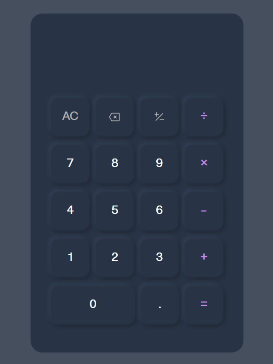

# Calculator App

A simple, responsive JavaScript calculator with a clean UI and support for basic arithmetic operations, decimal numbers, sign change, and undo functionality.  
The project is written in **vanilla JS** and split into separate modules for logic, rendering, and utility functions.



## 🚀 Live Demo

[View Live Demo](https://dee-diaz.github.io/calculator/)

## ✨ Features

- **Basic Operations**: Addition, subtraction, multiplication, division

- **Advanced Functionality**:
  - Decimal point operations
  - Negative number handling
  - Parentheses display for negative values
  - Undo functionality
  - Clear all operations

- **Edge Case Handling**:
  - Division by zero protection
  - Floating point precision management
  - Input validation
  
- **Responsive Design**: Works on desktop and mobile devices

## 🛠️ Built With

- **HTML5** - Semantic markup
- **CSS3** - Custom styling with CSS variables and responsive design
- **Vanilla JavaScript** - ES6+ features, modular architecture

## 🏗️ Architecture

The project follows modern JavaScript best practices with a modular architecture:

```
├── main.js          # Main calculator logic and state management
├── components/
│   ├── render.js    # DOM manipulation and display updates
│   └── utils.js     # Pure utility functions for calculations
├── style.css        # Styling and responsive design
└── index.html       # HTML structure
```

### Key Design Decisions

- **Separation of Concerns**: Logic, rendering, and utilities are cleanly separated
- **State Management**: Finite state machine approach for reliable operation handling
- **Pure Functions**: Mathematical operations are isolated for easy testing
- **ES6 Modules**: Modern import/export syntax for better code organization

## 🎯 Technical Highlights

- **Object-Oriented Design**: Calculator encapsulated as a single object with methods
- **State Machine Pattern**: Clear state transitions (OPERAND_1 → OPERATOR → OPERAND_2 → RESULT)
- **Error Handling**: Graceful handling of edge cases and invalid operations
- **Precision Management**: Automatic rounding for floating-point calculations
- **Event Delegation**: Efficient event handling with data attributes

## 🔧 Usage

1. **Basic Operations**: Click numbers and operators to perform calculations
2. **Decimal Numbers**: Use the decimal point button for floating-point operations
3. **Negative Numbers**: Use the ±/- button to toggle number signs
4. **Clear**: Use AC to clear all operations
5. **Undo**: Use the delete button to remove the last input
6. **Calculate**: Press = to execute the operation

## 📚 Learning Outcomes

While building this project, I practiced:

- **Modular JavaScript** — separating logic (`main.js`), UI rendering (`render.js`), and helpers (`utils.js`)
- **Finite State Machines** — managing app flow with clear states (`OPERAND_1`, `OPERATOR`, `OPERAND_2`, `RESULT`)
- **DOM Manipulation** — updating the display efficiently without re-rendering everything
- **Event Delegation** — handling all button clicks through a single event listener
- **Code Refactoring** — improving readability and maintainability by removing duplicate code
- **Edge Case Handling** — e.g., division by zero, sign changes for both operands, decimal point validation

## 🚀 Future Enhancements

- [ ] Keyboard input support

## 🤝 Contributing

This is a learning project, but feedback and suggestions are welcome! Feel free to open an issue or submit a pull request.

## 📄 License

This project is open source and available under the MIT License.
